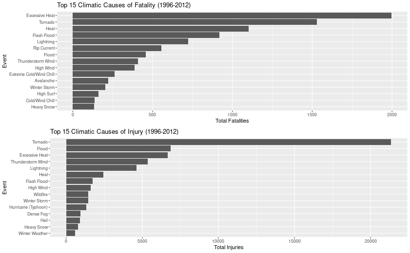
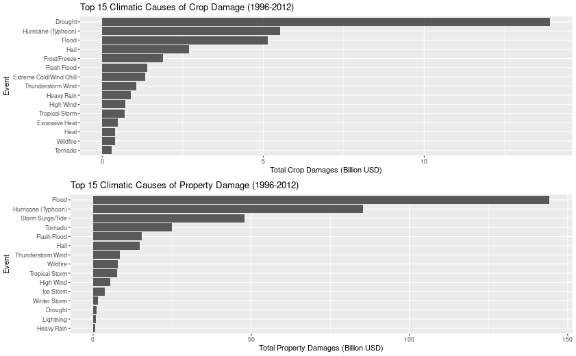
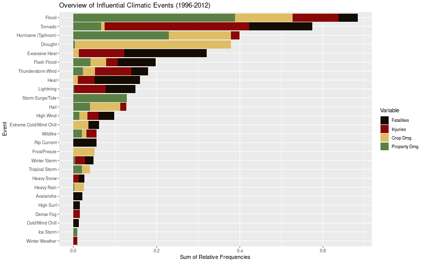

# Synopsis  
In this report we look at what storms have caused the greatest impact in the past. We address the health impacts of injuries and fatalities, and we also address the economic impacts of crops and properties. From these data we found that the greatest overall impact in both categories can be attributed to floods, tornadoes, and hurricanes. Other events of concern are excessive heat and general heat which caused a large impact to health. Drought and storm surges caused a large amount of crop and property damage as well.  

# Data Processing  

## Load Data
The storm data comes from the National Oceanic and Atmospheric Administration (NOAA) and will be downloaded now.  

```r
temp <- tempfile()
download.file("https://d396qusza40orc.cloudfront.net/repdata%2Fdata%2FStormData.csv.bz2",
              temp, mode = )
data <- read.csv(temp)
unlink(temp)
```

## Clean Data

```r
library(tidyverse)
library(reshape2)
library(ggpubr)
library(png)
```

Since we're interested in harm and economic impact we can filter out those relevant columns, this will help speed up the later analysis.  

```r
revData <- select(data, STATE__:EVTYPE, F:CROPDMGEXP, REMARKS, REFNUM)
revData <- revData %>% 
        mutate(BGN_TIME = as.POSIXct(strptime(paste(
                sub("0:00:00", "", BGN_DATE), sub(":","",BGN_TIME)), 
                                   format = "%m/%d/%Y %H%M"))) %>%
        select(-BGN_DATE)
```


The following code block is a set of logicals that will filter EVTYPE to be either one of the forty-eight official Event Names or "Other", if the EVTYPE can not be determined. In the case of an EVTYPE that had multiple events associated with it the Event Name will be assigned that would be the likely cause of damage (i.e. blizzards can cause avalanches so if EVTYPE is "BLIZZARD/AVALANCHE" it will be assigned the Event Name "Blizzard").

```r
correctedEvents <- revData %>% mutate(EVTYPE = case_when(
        grepl("low tide|blow-out", EVTYPE, TRUE) ~ 
                                                                "Astronomical Low Tide",
        grepl("blizzard", EVTYPE, ignore.case=TRUE) ~ 
                                                                "Blizzard",
        grepl("avalanc(h)?e", EVTYPE, TRUE) ~ 
                                                                "Avalanche", 
        grepl("coast", EVTYPE, TRUE) & grepl("flood|surge", EVTYPE, TRUE) ~
                                                                "Coastal Flood",
        grepl("cold|chill|low temp|cool|record low|hypo", EVTYPE, TRUE) &
               !grepl("snow|extreme|excessive|funnel|tornado", EVTYPE, TRUE) ~
                                                                "Cold/Wind Chill",
        grepl("debris|slide|(urban(.*)sm)|slump|ero", EVTYPE, TRUE) & 
                !grepl("flood|stream", EVTYPE, TRUE) ~ 
                                                                "Debris Flow",
        grepl("fog|wall", EVTYPE, TRUE) & 
                !grepl("freez|funnel", EVTYPE, TRUE) ~ 
                                                                "Dense Fog",
        grepl("smoke", EVTYPE, TRUE) ~ 
                                                                "Dense Smoke",
        grepl("drought|dry|(below(.*)pre)", EVTYPE, TRUE) & !grepl("heat|micro", EVTYPE, TRUE) ~
                                                                "Drought",
        grepl("dev[ei]l|gustn|landsp", EVTYPE, TRUE) ~ 
                                                                "Dust Devil",
        grepl("dust", EVTYPE, TRUE) ~ 
                                                                "Dust Storm",
        grepl("((excessive)|(extreme)) heat", EVTYPE, TRUE) ~
                                                                "Excessive Heat",
        (grepl("excessive|extreme", EVTYPE, TRUE) &
                grepl("cold|chil(l)?", EVTYPE, TRUE))|
                grepl("wind chill", EVTYPE, TRUE) ~
                                                                "Extreme Cold/Wind Chill",
        grepl("flash|rapid", EVTYPE, TRUE) ~ 
                                                                "Flash Flood",
        grepl("flood|stream|(high water)|(dam )|jam|drown", EVTYPE, TRUE) & 
                !grepl("lake", EVTYPE, TRUE) ~
                                                                "Flood",
        grepl("frost|freeze", EVTYPE, TRUE) ~ 
                                                                "Frost/Freeze",
        grepl("cloud|funnel", EVTYPE, TRUE) & 
                !grepl("waterspout|hail|thunder", EVTYPE, TRUE) ~ 
                                                                "Funnel Cloud",
        grepl("freezing fog", EVTYPE, TRUE) ~ 
                                                                "Freezing Fog",
        grepl("hail", EVTYPE, TRUE) & !grepl("tornado|marine", EVTYPE, TRUE) ~
                                                                "Hail",
        grepl("heat|hot|high temp|warm|record high|hyper", EVTYPE, TRUE) ~ 
                                                                "Heat",
        grepl("rain|((heavy|normal|excessive|record) prec)|wetn|(heavy show)", EVTYPE, TRUE) &
                !grepl("freez|snow|thunder|lightning|tstm|below|mix", EVTYPE, TRUE) ~
                                                                "Heavy Rain",
        grepl("snow", EVTYPE, TRUE) &
                !grepl("sleet|lake(-)?effect|freez|drought|ice",
                       EVTYPE, TRUE) ~ 
                                                                "Heavy Snow",
        grepl("surf|(high sea)|(high wav)", EVTYPE, TRUE) & !grepl("flood|rip", EVTYPE, TRUE) ~
                                                                "High Surf",
        (grepl("wind|microburst|downburst", EVTYPE, TRUE) & !grepl(
  "chill|thunder|tstm|hurricane|lightning|sea|winter|snow|coast|flood|marine|wet",
                                EVTYPE, TRUE)) |
          grepl("non(.*)wind", EVTYPE, TRUE) ~ 
                                                                "High Wind",
        grepl("hurricane|typhoon", EVTYPE, TRUE) ~ 
                                                                "Hurricane (Typhoon)",
        grepl("(ice (storm|pellets))|glaze", EVTYPE, TRUE)|
          grepl("^ice$", EVTYPE, TRUE) ~ 
                                                                "Ice Storm",
        grepl("lake[-| ]effect", EVTYPE, TRUE) ~ 
                                                                "Lake-Effect Snow",
        grepl("lake(.*)?flood", EVTYPE, TRUE) ~ 
                                                                "Lakeshore Flood",
        grepl("li(.*)[^zd]ing|thunder|tstm", EVTYPE, TRUE) &
          !grepl("wind", EVTYPE, TRUE) ~ 
                                                                "Lightning",
        grepl("marine hail", EVTYPE, TRUE) ~ 
                                                                "Marine Hail",
        grepl("(marine high)|(wind(.*?)sea)|(coast(.*)storm)|mishap|((heavy)|(rough) sea)", 
              EVTYPE, TRUE) ~ 
                                                                "Marine High Wind",
        grepl("marine strong", EVTYPE, TRUE) ~ 
                                                                "Marine Strong Wind",
        grepl("marine (thunderstorm|tstm)", EVTYPE, TRUE) ~ 
                                                                "Marine Thunderstorm Wind",
        grepl("rip", EVTYPE, TRUE) ~ 
                                                                "Rip Current",
        grepl("seiche", EVTYPE, TRUE) ~ 
                                                                "Seiche",
        grepl("(sleet)|(freezing rain)", EVTYPE, TRUE) ~ 
                                                                "Sleet",
        grepl("surge|(high (tide|sea))|swell|acci|rogue", EVTYPE, TRUE) ~ 
                                                                "Storm Surge/Tide",
        grepl("(strong wind)|turb", EVTYPE, TRUE) ~ 
                                                                "Strong Wind",
        grepl("(((thunder)|(tstm)|(light))(.*)?wind)|(wet micro)", EVTYPE, TRUE) &
                       !grepl("non|tornado|marine", EVTYPE, TRUE) ~ 
                                                                "Thunderstorm Wind",
        grepl("torn", EVTYPE, TRUE) & !grepl("waterspout", EVTYPE, TRUE) ~
                                                                "Tornado",
        grepl("depression", EVTYPE, TRUE) ~ 
                                                                "Tropical Depression",
        grepl("tropical storm", EVTYPE, TRUE) ~ 
                                                                "Tropical Storm",
        grepl("tsunami", EVTYPE, TRUE) ~ 
                                                                "Tsunami",
        grepl("volcan", EVTYPE, TRUE) ~ 
                                                                "Volcanic Ash",
        grepl("wa(.*)spo", EVTYPE, TRUE) ~ 
                                                                "Waterspout",
        grepl("fire", EVTYPE, TRUE) & !grepl("light", EVTYPE, TRUE) ~ 
                                                                "Wildfire",
        grepl("(winter weather)|icy|black|(ice(.*)road)|(ice floe)", EVTYPE, TRUE) ~ 
                                                                "Winter Weather",
        #Any winter mix that was bypassed previously had several aspects 
        #to it and will be grouped in with "Winter Storm"
        grepl("winter|snow|hail|sleet|freezing|mix", EVTYPE, TRUE) ~
                                                                "Winter Storm",
        TRUE ~ "Other"))
```

The NOAA started recording events in 1950, however they only recorded tornadoes at that time and started to add more events over the years. By 1996 they recorded all 48 types of events so in order to get a balanced look at all climatic events we'll analyze from 1996 to November of 2012 (The end of the readings).

```r
timeperiod <- c("1950-1995", "1996-2011(Nov)")
groupedData <- group_by(correctedEvents, 
                  Time.Period = ifelse((BGN_TIME <= strptime("1995", format = "%Y")), 
                         timeperiod[1], timeperiod[2]),
                  Event.Name = EVTYPE)

groupedData <- groupedData[groupedData$Time.Period == timeperiod[2],]
groupedData <- group_by(groupedData, Event.Name)
```

Some of the original data returned `NA`s when adjusting the time variable earlier, let's look at how those times were entered and what dates they were recorded.

```r
erredData <- data[is.na(revData$BGN_TIME),]
data.frame(Time = erredData$BGN_TIME, Date = strptime(erredData$BGN_DATE, format = "%m/%d/%Y"))
```

```
##   Time       Date
## 1 1990 1993-01-12
## 2 9999 1993-12-25
## 3 2090 1994-06-29
## 4 1580 1995-08-16
## 5 0572 1995-08-28
## 6 13O0 1995-05-24
```
  
It can be seen here the times were invalid either because the minutes were greater than 60 or the letter "O" was entered instead of a "0". Either way, these dates are outside of our range of interest so they can be safely discarded.  

```r
groupedData <- groupedData[!is.na(groupedData$BGN_TIME),]
```


## Most Harmful Events to Population Health  


```r
summary <- groupedData %>% summarize(
                         totalFatalities = sum(FATALITIES), 
                         totalInjuries   = sum(INJURIES))
```

Since we're only interested in the most harmful events we're going to look at the top 15 events for both fatalities and injuries.

```r
fatalities <- arrange(summary, desc(totalFatalities))[1:15,] %>% 
        select(Event.Name, Total = totalFatalities)
injuries   <- arrange(summary, desc(totalInjuries))[1:15,] %>% 
        select(Event.Name, Total = totalInjuries)
```
These subsets make up 91.3% of fatalities and 94.5% of injuries.


```r
fatalPlot <- ggplot(fatalities, aes(Total, reorder(Event.Name, Total))) + 
        geom_bar(stat = "identity") +
        xlab("Total Fatalities") +
        ylab("Event") +
        ggtitle("Top 15 Climatic Causes of Fatality (1996-2012)")

injuryPlot <- ggplot(injuries, aes(Total, reorder(Event.Name, Total))) + 
        geom_bar(stat = "identity") +
        xlab("Total Injuries") +
        ylab("Event") +
        ggtitle("Top 15 Climatic Causes of Injury (1996-2012)")

#Creating png file of two plots
phi <- (1+sqrt(5))/2
h <- 520
png("./Images/harm_plot.png", height = h, width = h*phi)
ggarrange(fatalPlot, injuryPlot, ncol = 1)
dev.off()
```


  
From this figure we can see the most fatalities come from Excessive Heat, Tornado, and Heat types of events. We can also see the most injuries come from Tornado, Flood, and Excessive Heat types of events.


## Events Causing Greatest Economic Consequences  
CROPDMGEXP and PROPDMGEXP indicate the scale of U.S. dollars that the respective damage is recorded on (H for hundred, K for thousand, M for million, and B for billion). So we'll add a numeric representation of this value to use when summing the damages.  

```r
groupedData <- groupedData %>% mutate(CropMultiple = case_when(
        toupper(CROPDMGEXP) == "H" ~ 10^2,
        toupper(CROPDMGEXP) == "K" ~ 10^3,
        toupper(CROPDMGEXP) == "M" ~ 10^6,
        toupper(CROPDMGEXP) == "B" ~ 10^9,
        TRUE ~ NaN),
        PropMultiple = case_when(
        toupper(PROPDMGEXP) == "H" ~ 10^2,
        toupper(PROPDMGEXP) == "K" ~ 10^3,
        toupper(PROPDMGEXP) == "M" ~ 10^6,
        toupper(PROPDMGEXP) == "B" ~ 10^9,
        TRUE ~ NaN
))
```

We'll now create a summary of the damages, grouped by each event type.  

```r
DMGsummary <- groupedData %>% summarize(
                         cropDamages = sum(CROPDMG*CropMultiple, na.rm = TRUE)/10^9, 
                         propDamages = sum(PROPDMG*PropMultiple, na.rm = TRUE)/10^9)
```

Since we're only interested in the greatest economic consequences we, again, are going to look at the top 15 events for both property and crop damages.  

```r
crop <- arrange(DMGsummary, desc(cropDamages))[1:15,] %>% 
        select(Event.Name, Total = cropDamages)
prop   <- arrange(DMGsummary, desc(propDamages))[1:15,] %>% 
        select(Event.Name, Total = propDamages)
```
These subsets make up 99.3% of crop damages and 99.4% of property damages.  


```r
cropPlot <- ggplot(crop, aes(Total, reorder(Event.Name, Total))) + 
        geom_bar(stat = "identity") +
        xlab("Total Crop Damages (Billion USD)") +
        ylab("Event") +
        ggtitle("Top 15 Climatic Causes of Crop Damage (1996-2012)")

propPlot <- ggplot(prop, aes(Total, reorder(Event.Name, Total))) + 
        geom_bar(stat = "identity") +
        xlab("Total Property Damages (Billion USD)") +
        ylab("Event") +
        ggtitle("Top 15 Climatic Causes of Property Damage (1996-2012)")

#Creating png file of two plots
phi <- (1+sqrt(5))/2
h <- 520
png("./Images/econ_impact_plot.png", height = h, width = h*phi)
ggarrange(cropPlot, propPlot, ncol = 1)
dev.off()
```


  
From this figure we can see the most crop damage comes from Drought, Hurricane (Typhoon), and Flood types of events. We can also see the most property damage comes from Flood, Hurricane (Typhoon), and Storm Surge/Tide types of events.

# Results  
To summarize these data and see which climatic event is most influential to our citizen's health and economy we're going to look at the sum of the relative frequency of each group's top 15 events.  

```r
total <- data.frame(fatalities = sum(summary$totalFatalities),
                    injuries   = sum(summary$totalInjuries),
                    cropDMG    = sum(DMGsummary$cropDamages),
                    propDMG    = sum(DMGsummary$propDamages))

freqs <- data.frame(f.relFreq = fatalities$Total/total$fatalities,
                    i.relFreq = injuries$Total/total$injuries,
                    c.relFreq = crop$Total/total$cropDMG,
                    p.relFreq = prop$Total/total$propDMG)

topEvents <- data.frame(Event = 
        c(fatalities$Event.Name, injuries$Event.Name, crop$Event.Name, prop$Event.Name))
topEvents <- cbind(topEvents, melt(freqs))

freqSummary <- topEvents %>% group_by(Event) %>% summarize(CombinedRelFreq = sum(value))  %>%
        arrange(desc(CombinedRelFreq))

#Creating the plot
topEvents <- merge(topEvents, freqSummary, by = "Event")
pal <- c("#140B02", "#8A0707", "#DEBD64", "#5B8045")
overviewPlot <- ggplot(topEvents, aes(value, reorder(Event, CombinedRelFreq), fill = variable)) +
        geom_bar(stat = "identity") +
        scale_fill_manual(values = pal,
                 labels = c("Fatalities", "Injuries", "Crop Dmg.", "Property Dmg.")) +
        xlab("Sum of Relative Frequencies") +
        ylab("Event") +
        ggtitle("Overview of Influential Climatic Events (1996-2012)") +
        labs(fill = "Variable")

#Saving plot to file
png("./Images/overview_plot.png", height = h, width = h*phi)
overviewPlot
dev.off()
```

  
From this plot we can see the largest impacts come from Flood, Tornado, and Hurricane (Typhoon) types of events.


